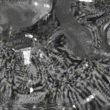

# stirSplash
<p float="left">
  

</p>

**stirSplash** is a Blender-rendered, physics-based fluid simulation visualization pipeline powered by [SPlisHSPlasH](https://github.com/InteractiveComputerGraphics/SPlisHSPlasH). It automates batch simulations and high-quality rendering of rotating impeller-driven fluids, enabling dataset generation and visual effects production for research and media use.

## 🌊 Features

- Batch fluid simulation using [SPlisHSPlasH](https://github.com/InteractiveComputerGraphics/SPlisHSPlasH) with randomized physical properties (density, viscosity, surface tension)
- Time-varying impeller motion based on RPM sequences
- Mesh reconstruction using [splashsurf](https://github.com/InteractiveComputerGraphics/splashsurf)
- Automated Blender rendering with controllable materials and lighting
- Scriptable generation of render variants (material, lighting, camera)
- Exported mesh sequences and videos for each simulation
- Dataset and config management with JSON/CSV

## 🚀 Quick Start

### 1. Clone the Repository

```bash
git clone https://github.com/JMacoustic/stirSplash.git
cd stirSplash
```

### 2. Add Blender
Place the 'blender-4.3.2-windows-x64/' folder inside the stirSplash directory.

### 3. Configure Simulation
Edit the datagenerator.json file to set:
- Number of simulations
- Property ranges (density, viscosity, surface tension)
- RPM profile
- Rendering variants

### 4. Run Everything (on Windows)
```bash
run.bat
```